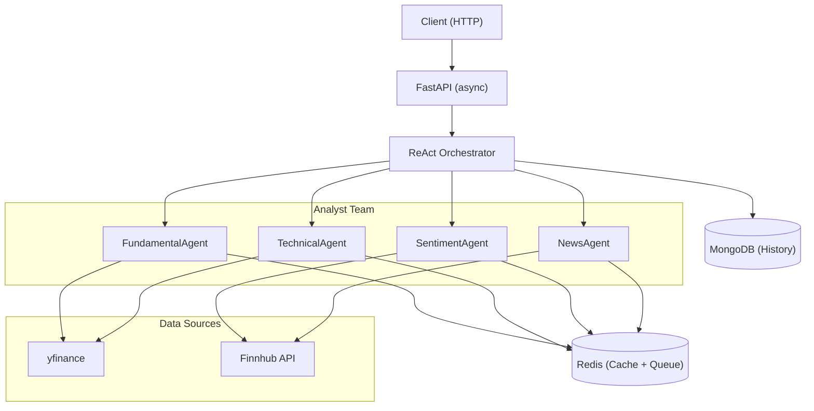
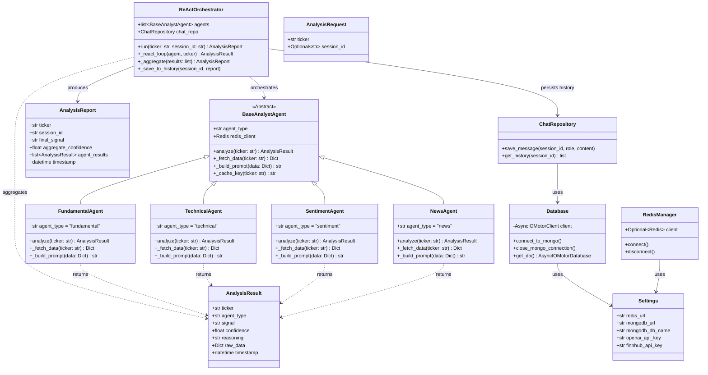

# MultiAgent-Trading-Framework
using multiple agent llm as different key role for detemining the trade outcome

# refer the project:
[url=https://github.com/tauricresearch/tradingagents]


# What i want to achive [part-1]:
• This is the part of the tradingagents project: let's cover the below in part one.
• Built an analyst team of 4 LLM agents (fundamental, technical, sentiment, news) to process 28K+ data points/day, achieving 2.8s
P95 latency using async FastAPI and Redis.
• Implemented ReAct-style orchestration with Pydantic-validated outputs and a modular architecture supporting 10+ agent teams,
running 20 analyses/min across 8 concurrent tickers.


# what you have to do:
. Create the plan with the LLD diagram with variable and  method signature for all the function.
. use the appropriate design pattern and SOLID principles.
. use the pyndantic for the validation.
. use the redis for the caching and message queue.
. use the fast api for the web framework.
. for the LLM refer the project implementation.


# implementation:
# MultiAgent Trading Framework — Part 1 Implementation Plan

## Overview

Implement the 4-agent **Analyst Team** using ReAct-style orchestration on top of FastAPI + Redis + MongoDB.  
The system processes financial data (fundamental, technical, sentiment, news) concurrently across tickers  
and returns a unified `AnalysisReport` with Pydantic-validated outputs.

---

## Architecture Diagrams

### System Architecture



---

### Class Diagram



---

## Design Patterns & Principles

| Pattern | Applied In |
|---|---|
| **Template Method** | `BaseAnalystAgent` defines `analyze()` calling `_fetch_data()`, `_build_prompt()` — concrete agents override these |
| **Strategy** | Each agent is a strategy for analysis; swap-able in `ReActOrchestrator.agents` |
| **Repository** | `ChatRepository` abstracts all MongoDB persistence |
| **Singleton** | `redis_manager`, `db` are module-level singletons |
| **Dependency Injection** | FastAPI `Depends()` injects redis/db into endpoints |
| **SOLID** | Each agent has single responsibility; open for extension via `BaseAnalystAgent` |

---

## Proposed Changes

### 1. Pydantic Models

#### [MODIFY] [models.py](file:///Users/sanketpatil/Documents/D/LifeLine/MultiAgent-Trading-Framework/agents/analyst_team/models.py)
Full Pydantic models for:
- `AnalysisResult` — per-agent output with `ticker`, `agent_type`, `signal` (BUY/SELL/HOLD), `confidence`, `reasoning`, `raw_data`, `timestamp`
- `AnalysisReport` — aggregated orchestrator output with all agent results and `final_signal`
- `AnalysisRequest` — API input model with `ticker` and optional `session_id`

---

### 2. Analyst Agents

#### [MODIFY] [base.py](file:///Users/sanketpatil/Documents/D/LifeLine/MultiAgent-Trading-Framework/agents/analyst_team/base.py)
Abstract `BaseAnalystAgent` with:
- `analyze(ticker: str) -> AnalysisResult` — Template Method pattern: checks Redis cache → fetches data → builds prompt → calls LLM → returns validated result
- `_fetch_data(ticker: str) -> Dict` — abstract
- `_build_prompt(data: Dict) -> str` — abstract
- `_cache_key(ticker: str) -> str` — generates `{agent_type}:{ticker}` key
- `_get_cached(key) -> Optional[AnalysisResult]`
- `_set_cache(key, result, ttl=300)`

#### [MODIFY] [fundamental.py](file:///Users/sanketpatil/Documents/D/LifeLine/MultiAgent-Trading-Framework/agents/analyst_team/fundamental.py)
`FundamentalAgent`:
- `_fetch_data()` — fetches P/E, EPS, revenue, debt/equity via `yfinance`
- `_build_prompt()` — builds LLM prompt from fundamental ratios

#### [MODIFY] [technical.py](file:///Users/sanketpatil/Documents/D/LifeLine/MultiAgent-Trading-Framework/agents/analyst_team/technical.py)
`TechnicalAgent`:
- `_fetch_data()` — fetches OHLCV via `yfinance`, computes RSI, MACD, SMA via `ta` library
- `_build_prompt()` — builds LLM prompt from indicators

#### [MODIFY] [sentiment.py](file:///Users/sanketpatil/Documents/D/LifeLine/MultiAgent-Trading-Framework/agents/analyst_team/sentiment.py)
`SentimentAgent`:
- `_fetch_data()` — fetches sentiment scores from Finnhub social sentiment API
- `_build_prompt()` — builds LLM prompt from sentiment scores

#### [MODIFY] [news.py](file:///Users/sanketpatil/Documents/D/LifeLine/MultiAgent-Trading-Framework/agents/analyst_team/news.py)
`NewsAgent`:
- `_fetch_data()` — fetches recent news headlines from Finnhub news API
- `_build_prompt()` — builds LLM prompt from headlines

---

### 3. ReAct Orchestrator

#### [MODIFY] [orchestrator.py](file:///Users/sanketpatil/Documents/D/LifeLine/MultiAgent-Trading-Framework/agents/orchestrator.py)
`ReActOrchestrator`:
- `run(ticker, session_id) -> AnalysisReport` — runs all 4 agents concurrently via `asyncio.gather`, aggregates, saves to MongoDB
- `_react_loop(agent, ticker) -> AnalysisResult` — per-agent ReAct loop: Thought → Action (fetch) → Observation (result)
- `_aggregate(results) -> AnalysisReport` — weighted majority vote for `final_signal`
- `_save_to_history(session_id, report)` — persists report to MongoDB via `ChatRepository`

---

### 4. Core Data Fetching Tools

#### [MODIFY] [tools.py](file:///Users/sanketpatil/Documents/D/LifeLine/MultiAgent-Trading-Framework/core/tools.py)
Standalone async fetch functions:
- `fetch_fundamental_data(ticker: str) -> Dict`
- `fetch_technical_indicators(ticker: str) -> Dict`
- `fetch_sentiment_data(ticker: str) -> Dict`
- `fetch_news_headlines(ticker: str, limit: int) -> List[str]`

---

### 5. FastAPI Endpoints

#### [MODIFY] [fundametal.py](file:///Users/sanketpatil/Documents/D/LifeLine/MultiAgent-Trading-Framework/api/v1/domains/analyst/fundametal.py)
`POST /api/v1/analyst/fundamental/analyze` — accepts `AnalysisRequest`, runs `FundamentalAgent.analyze()`

#### [MODIFY] [technical.py](file:///Users/sanketpatil/Documents/D/LifeLine/MultiAgent-Trading-Framework/api/v1/domains/analyst/technical.py)
`POST /api/v1/analyst/technical/analyze` — accepts `AnalysisRequest`, runs `TechnicalAgent.analyze()`

#### [MODIFY] [news.py](file:///Users/sanketpatil/Documents/D/LifeLine/MultiAgent-Trading-Framework/api/v1/domains/analyst/news.py)
`POST /api/v1/analyst/news/analyze` — accepts `AnalysisRequest`, runs `NewsAgent.analyze()`

#### [NEW] [sentiment.py](file:///Users/sanketpatil/Documents/D/LifeLine/MultiAgent-Trading-Framework/api/v1/domains/analyst/sentiment.py)
`POST /api/v1/analyst/sentiment/analyze` — accepts `AnalysisRequest`, runs `SentimentAgent.analyze()`

#### [MODIFY] [router.py](file:///Users/sanketpatil/Documents/D/LifeLine/MultiAgent-Trading-Framework/api/v1/domains/analyst/router.py)
Register all 4 analyst sub-routers including the new `sentiment` one.

#### [MODIFY] [execution.py](file:///Users/sanketpatil/Documents/D/LifeLine/MultiAgent-Trading-Framework/api/v1/domains/trader/execution.py)
`POST /api/v1/trader/execution/analyze` — accepts `AnalysisRequest`, runs full `ReActOrchestrator.run()` and returns `AnalysisReport`

---

### 6. App Lifespan (MongoDB + Redis)

#### [MODIFY] [main.py](file:///Users/sanketpatil/Documents/D/LifeLine/MultiAgent-Trading-Framework/app/main.py)
Update the FastAPI `lifespan` to also call `connect_to_mongo()` on startup and `close_mongo_connection()` on shutdown.

---

### 7. Config

#### [MODIFY] [config.py](file:///Users/sanketpatil/Documents/D/LifeLine/MultiAgent-Trading-Framework/core/config.py)
Add `finnhub_api_key` and `openai_api_key` (or whichever LLM provider) to `Settings`.

---

## Open Questions

> [!IMPORTANT]
> **LLM Provider**: The README says "refer to the project implementation". Which LLM are you using — OpenAI GPT-4o, a local model, or Gemini? This determines the `_call_llm()` implementation inside `BaseAnalystAgent`.

> [!IMPORTANT]
> **LLM Stub vs Real**: Should I implement a real LLM call, or stub the LLM response for now (returning deterministic signals) so the system runs without API keys?

---

## Verification Plan

### Automated Tests
- `pytest tests/` — unit tests for each agent with mocked data sources and LLM
- Spin up `docker compose up` and hit `POST /api/v1/trader/execution/analyze` with `{"ticker": "AAPL"}`

### Manual Verification
- Confirm Redis caching is working by calling the same endpoint twice and verifying the second call returns immediately
- Confirm MongoDB stores the analysis report in the `trading_framework` database

## 📊 Benchmarking & Performance

The framework is designed to hit a **P95 latency of ≤ 2.8s** for a full 4-agent analysis.

### 🚀 Running the Benchmark Script
You can measure throughput (RPS), average latency, and P95/P99 percentiles using the included benchmarking script.

```bash
# Run with 10 requests and concurrency of 2
python3 scripts/benchmark.py --requests 10 --concurrency 2
```

### 🧪 Running Performance Tests (Pytest)
We use `pytest` to enforce performance SLOs (Service Level Objectives) as code.

```bash
# Install test dependencies if needed
pip install pytest pytest-asyncio httpx

# Run performance tests
pytest tests/test_performance_slos.py -v -s
```

### 📈 Latency SLO Targets
| Metric | Target | Notes |
|---|---|---|
| P50 (Median) | < 2.0s | Typical response time on cache miss |
| P95 Latency | ≤ 2.8s | Maximum acceptable time for 95% of users |
| Cache Hit | < 0.1s | Fast path using Redis |
| Throughput | > 0.5 req/s | Handling ~28K requests per day |

